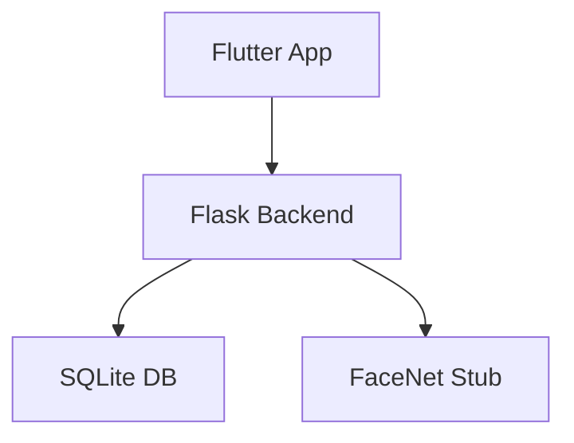

# Attendance Management System (Backend + Flutter)

## Overview
A full-stack attendance tracking demo featuring a Flask backend secured with JWT authentication and supporting both manual and face-recognition check-ins, plus analytics over a SQLite database seeded with sample data and a FaceNet stub microservice. The companion Flutter mobile dashboard targets Android emulators, authenticating with the demo staff account (`teacher1` / `secret123`) and presenting attendance insights, marks, schedules, and a geofence-gated face-mark flow for `student1`.

## Architecture                     
```
[Flutter App] <-> [Flask API] <-> [SQLite DB]
                  \-> [FaceNet Stub @8001]
```
- Core modules: `config.py`, `attendance_backend/app.py`, `attendance_backend/extensions.py`, `attendance_backend/models.py`, `attendance_backend/seeder.py`
- Blueprints: `attendance_backend/auth_routes.py`, `attendance_backend/attendance_routes.py`, `attendance_backend/analytics_routes.py`, `attendance_backend/health_routes.py`
- Scripts: `scripts/run_backend_with_check.sh`, `scripts/run_facenet.sh`, `scripts/smoke_auth_attendance.sh`, `scripts/smoke_face_attendance.sh`, `scripts/verify_facenet_stack.sh`, `scripts/verify_full_stack.sh`, `scripts/verify_manual_attendance.sh`
- Flutter app: `lib/api.dart`, `lib/providers/`, `lib/screens/`, `lib/main.dart`

## Prerequisites
- Python 3.13 (project tested on 3.10+)
- Flutter SDK (3.19+ recommended)
- Android Studio with an Android emulator or physical device
- macOS/Linux shell tooling (`bash`, `curl`, `python`, etc.)

## Backend Setup & Run
```bash
cd /Users/nishant/services/attendance_backend
python3 -m venv .venv
source .venv/bin/activate
pip install -U pip
pip install -r requirements.txt
python -m pytest -q --tb=short
flask --app attendance_backend.app run --host=0.0.0.0 --port=8000
curl http://127.0.0.1:8000/api/health
```
- Configuration is defined in `config.py` via `Config` (default) and `TestConfig`. The seeder runs only when `TESTING=False`, so production-like launches seed SQLite automatically while tests use isolated in-memory databases.

## Database & Seeding
- **Schema summary**: Teachers, Students, Courses, Sessions, and Attendance tables, enum-backed statuses, and `UNIQUE(student_id, session_id)` enforcing single attendance records per session.
- **Seeder behavior**: Idempotently provisions the staff user `teacher1/secret123`, student `student1/secret123`, course `CS101`, and a current session enabling immediate manual or face attendance scenarios.

## API Endpoints
| Group | Endpoint | Description |
| ----- | -------- | ----------- |
| Auth | `POST /api/auth/login` | Returns `{access_token}` after verifying credentials. |
| Attendance | `GET /api/attendance/sessions` | Lists available sessions for manual/face check-in. |
|  | `POST /api/attendance/mark/manual` | Accepts `{student_username, session_id, status}`; returns 200/201. |
|  | `POST /api/attendance/mark/face` | Accepts `{student_username, session_id, image_base64}`; returns 200/201, 502 if FaceNet errors. |
|  | `POST /api/attendance/geofence-check` | Accepts `{latitude, longitude}`; returns `{allowed}`. |
|  | `GET /api/attendance/face-health` | Checks FaceNet microservice availability. |
| Analytics | `GET /api/analytics/attendance-insights?student_username=...` | Provides summary stats for dashboard charts. |
|  | `GET /api/analytics/marks?student_username=...` | Returns mark breakdowns. |
|  | `GET /api/schedule?student_username=...` | Lists upcoming sessions for the dashboard schedule. |
| Health | `GET /api/health` | Basic readiness probe. |

## FaceNet Stub
- Runs separately on port 8001 (`services/facenet_service`). The Flask backend proxies face attendance calls to this service.
- When TensorFlow is unavailable the stub returns deterministic fake embeddings, but adheres to the same request/response contracts, so backend and Flutter flows remain functional.

## Test Suite
- Run with `python -m pytest -q --tb=short`.
- Covers the app factory wiring, model constraints/enums, JWT auth, manual and face attendance routes, analytics queries, geofence checks, health endpoint, and seeder behavior.
- FaceNet HTTP interactions are monkeypatched to keep tests deterministic and offline.

## Flutter App Setup
```bash
cd ~/attendance_app
flutter pub get
flutter run
```
- Use the Android emulator-friendly backend base URL `http://10.0.2.2:8000/api` (already configured in `lib/api.dart`).
- Login defaults are `teacher1` / `secret123`; the dashboard fetches data for `student1`, and the FAB performs geofence verification before calling the face attendance endpoint.

## Android Emulator & Geofence
- Set emulator location via **Extended Controls → Location** and position the pin near latitude `28.6139`, longitude `77.2090` (within ~200 m of the campus geofence).
- Required manifest permissions: `INTERNET`, `ACCESS_FINE_LOCATION`, `ACCESS_COARSE_LOCATION` (already declared in `android/app/src/main/AndroidManifest.xml`).

## Troubleshooting
- `ModuleNotFoundError: config` → ensure `config.py` exists in the backend repo root and PYTHONPATH includes it.
- Circular import errors → confirm `db`/`jwt` imports originate from `attendance_backend/extensions.py`.
- Flutter “Network error” → verify the backend is running and the base URL remains `http://10.0.2.2:8000/api` for the emulator.
- Face attendance 502 → start the FaceNet stub service or rely on test monkeypatches.
- `flask` “app not found” → launch with `flask --app attendance_backend.app run --host=0.0.0.0 --port=8000`.

## Directory Structure
```text
attendance_app/
├─ README.md
├─ lib/
│  ├─ api.dart
│  ├─ providers/
│  │  ├─ auth_provider.dart
│  │  └─ data_provider.dart
│  └─ screens/
│     ├─ login_screen.dart
│     └─ dashboard_screen.dart
├─ android/app/src/main/AndroidManifest.xml
└─ pubspec.yaml

services/attendance_backend/
├─ config.py
├─ attendance_backend/
│  ├─ app.py
│  ├─ extensions.py
│  ├─ models.py
│  ├─ auth_routes.py
│  ├─ attendance_routes.py
│  ├─ analytics_routes.py
│  ├─ health_routes.py
│  └─ seeder.py
├─ scripts/
│  ├─ run_backend_with_check.sh
│  ├─ run_facenet.sh
│  └─ verify_full_stack.sh (plus smoke scripts)
└─ tests/
   └─ ... pytest suite ...

services/facenet_service/
└─ facenet_service.py
```

## License / Credits
Placeholder: prepared as part of an academic submission. Replace with the appropriate license text before distribution.

## Quick Start Walkthrough
1. **Start the Flask backend**
   ```bash
   cd /Users/nishant/services/attendance_backend
   source .venv/bin/activate  # create & install deps if not done yet
   flask --app attendance_backend.app run --host=0.0.0.0 --port=8000
   ```
2. **Launch the FaceNet stub service** (separate terminal)
   ```bash
   cd /Users/nishant/services/facenet_service/facenet_service
   source ../../attendance_backend/.venv/bin/activate  # reuse backend venv or create new one
   python facenet_service.py
   ```
3. **Run the Flutter dashboard in an Android emulator**
   ```bash
   cd ~/attendance_app
   flutter run
   ```
4. **Log in using the seeded staff account**
   - Credentials: **teacher1 / secret123**
   - Expected result: dashboard loads with insights for `student1`.
5. **Mark manual attendance for `student1`**
   - First grab a fresh token (if not capturing it from the Flutter logs):
     ```bash
     curl -X POST http://127.0.0.1:8000/api/auth/login \
       -H "Content-Type: application/json" \
       -d '{"username": "teacher1", "password": "secret123"}'
     ```
     Copy the `access_token` value from the JSON response.
   - Then call the manual attendance endpoint:
     ```bash
     curl -X POST http://127.0.0.1:8000/api/attendance/mark/manual \
       -H "Authorization: Bearer <ACCESS_TOKEN>" \
       -H "Content-Type: application/json" \
       -d '{"student_username": "student1", "session_id": 1, "status": "present"}'
     ```
   - Verify a `200` or `201` response.
6. **Observe dashboard insights and schedule**
   - Top card shows updated attendance percentage.
   - Marks card lists enrolled courses; schedule card shows upcoming session(s).
7. **Simulate geofence behaviour in the emulator**
   - Set GPS **near Delhi**: Extended Controls → Location → latitude `28.6139`, longitude `77.2090`, radius ≤ 200 m → **FAB should allow face mark**.
   - Set GPS **far away** (e.g., latitude `51.5074`, longitude `-0.1278`) → geofence check fails and snackbar warns about location.

## Screenshots


## Future Work
- Replace the FaceNet stub with a production TensorFlow model and real embeddings management.
- Add CI/CD pipelines covering backend tests, Flutter analyzer, and deployment automation.
- Introduce role-based dashboards for students, teachers, and administrators.
- Deliver push notifications reminding students of upcoming sessions or low attendance.
- Extend mobile support to iOS with proper permissions and platform-specific integrations.

## Sample API Responses
```jsonc
// POST /api/auth/login
{
  "access_token": "eyJhbGciOiJIUzI1NiIsInR5cCI6IkpXVCJ9...",
  "token_type": "bearer",
  "expires_in": 3600
}
```
```jsonc
// POST /api/attendance/mark/manual
{
  "message": "Attendance recorded",
  "session_id": 1,
  "student_username": "student1",
  "status": "present",
  "recorded_at": "2024-05-10T09:00:00Z"
}
```
```jsonc
// GET /api/analytics/attendance-insights?student_username=student1
{
  "student_username": "student1",
  "total_sessions": 10,
  "attended_sessions": 8,
  "absent_sessions": 2,
  "percentage": 80.0
}
```
```jsonc
// POST /api/attendance/geofence-check
{
  "allowed": true,
  "message": "Within campus perimeter"
}
```

## Architecture Diagram

